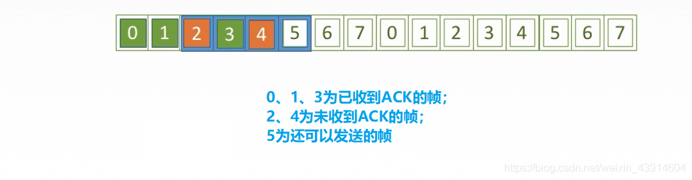
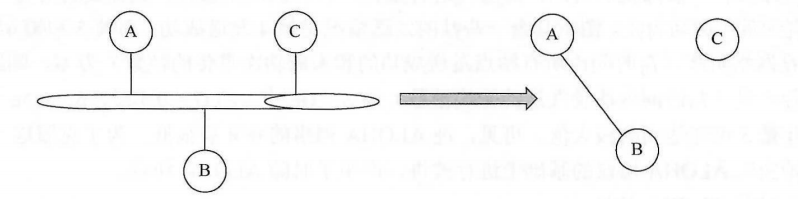
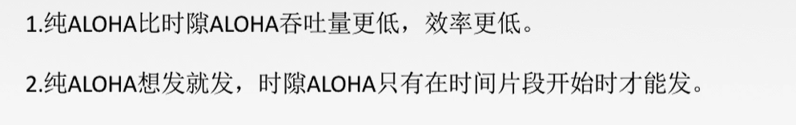
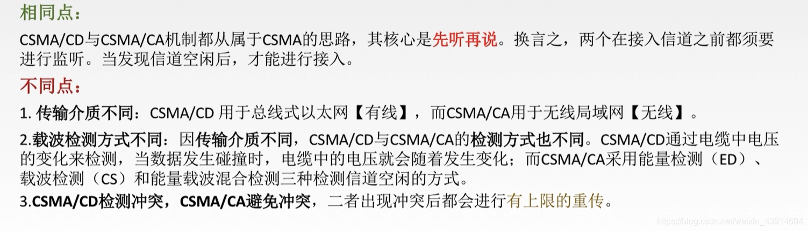

# 数据链路层

## 3.1 数据链路层的功能

### 3.1.1 数据链路层的基本概念和功能概述

#### 1.基本概念

#### 2.功能概述

- 因为物理层可能会把数据弄丢，所以数据链路层需要进行一些设置来使得物理层可以可靠的传输数据

## 3.2 组帧

###  3.2.1 封装成帧、帧定界、帧同步、透明传输

#### 1 封装成帧、帧定界、帧同步

- 关于组帧的四种方法我们还得了解一下透明传输的概念

#### 2.组帧的四种方法

##### （1）字符计数法

##### （2）字符填充的首尾定界法

- 发送方在封装帧时，数据的可能有图中两种类型，传输数据时可能会出现图中所述的错误

- 那么我们如何去解决这种错误呢？

- 我们可以在特殊字符（SOH、EOT、ESC）前面填充一个转义字符来区分

- 发送方在封装帧时，进行扫描，扫描到SOH、EOT、ESC（转义字符）时在其前面添加转义字符，以区分，告诉接受方这个和特殊字符相同的字符是数据，当然这些约定由双方之间的协议完成

  

##### （3）零比特填充的首尾标志法

##### （4）违规编码法

- 目前比较常用的编码方式

## 3.3 差错控制

### 3.3.1 数据链路层之差错控制

#### 0.脑图时刻

#### 1.为什么会出现差错？

#### 2.检验和纠正差错的编码方法

##### （1）关于数据链路层和物理层的编码区别

##### （2）冗余编码

#### 3.检错编码

##### （1）奇偶校验码

##### （2）循环冗余码CRC

#### 4.纠错编码（海明码）

##### (1)确定校验码位数r

##### (2)确定校验码和数据的位置

##### (3)求出校验码的值

##### (4)检错与纠错

## 3.4 流量控制与可靠传输机制

### 3.4.1 流量控制

#### 0 思维导图

#### 1 什么是流量控制？

- 流量控制是数据链路层的一种功能，流量控制对数据链路上的帧的发送速率进行控制，以使接收方有足够的缓冲空间来接受每个帧
- 流量控制的基本方法是由接收方控制发送方发送数据的速率
- 常见的流量控制方式有两种：`停止-等待协议、滑动窗口协议`

#### 2 什么是可靠传输机制？

- 可靠传输机制是为了使数据可以正确稳定的传输和接收而制定的规则。

- 数据链路层的可靠传输通常使用确认和超时重传两种机制来完成。

- 确认是一种无数据的控制帧，这种控制帧使得接收方可以让发送方知道哪些内容被正确接收。有些情况下为了提高传输效率，将确认捎带在一个回复帧中，称为捎带确认。

- 超时重传是指发送方在发送某一个数据帧以后就开始一个计时器，在一定时间内如果没有得到发送的数据帧的确认帧，那么就重新发送该数据帧，直到发送成功为止。

- 自动重传请求（Auto Repeat reQuest，ARQ），通过接收方请求发送方重传出错的数据帧来恢复出错的帧，是通信中用于处理信道所带来差错的方法之一。

- 传统自动重传请求分为三种，即停等式（Stop-and-Wait）ARQ、后退N帧（Go-Back-N）ARQ以及选择性重传（Selective Repeat）ARQ。后两种协议是滑动窗口技术与请求重发技术的结合，由于窗口尺寸开到足够大，帧在线路上可以连续地流动，因此又称为连续ARQ协议。

#### 3 什么是滑动窗口机制？

- 滑动窗口协议的基本原理就是在任意时刻，发送方都维持了一个连续的允许发送的帧的序号，称为发送窗口；同时，接收方也维持了一个连续的允许接收的帧的序号，称为接收窗口。
- 发送窗口和接收窗口的序号的上下界不一定要一样，甚至大小也可以不同。
- 不同的滑动窗口协议窗口大小一般不同。
- 发送方窗口内的序列号代表了那些已经被发送，但是还没有被确认的帧，或者是那些可以被发送的帧。

- 在发送端，每收到一个确认帧，发送窗口就向前滑动一个帧的位置，当发送窗口内没有可以发送的帧（即窗口内的帧全部是已发送但未收到确认的帧），发送方就会停止发送，直到收到接受方发送的确认帧使窗口移动，窗口内有可以发送的帧，之后才开始继续发送。

- 在接受端，当收到数据帧后，将窗口向前移一个位置，并发回确认帧，若收到的数据帧落在接受窗口之外则一律丢弃。

- 滑动窗口有以下重要特性：
  - 只有接受窗口向前滑动时（同时接受方发送确认帧），发送窗口才有可能（只有发送方收到确认帧才是一定）向前滑动。
  - 从滑动窗口的概念看，停止-等待协议、后退N帧协议和选择重传协议只有在发送窗口大小和接收窗口大小有所差别。
  - 停止-等待协议：发送窗口大小=1，接受窗口大小=1；
  - 后退N帧协议：发送窗口大小>1，接受窗口大小=1；
  - 选择重传协议：发送窗口大小>1，接受窗口大小>1；
  - 当接受窗口的大小为1时，可保证帧的有序接受。

#### 4 可靠传输、流量控制、滑动窗口之间的关系

#### 5 停止-等待协议

- 停止-等待协议也称为单帧滑动窗口与停止-等待协议
- 当发送窗口和接收窗口的大小固定为1时，滑动窗口协议退化为停等协议（stop-and-wait）。
- 该协议规定发送方每发送一帧后就要停下来，等待接收方已正确接收的确认（acknowledgement）返回后才能继续发送下一帧。
- 由于接收方需要判断接收到的帧是新发的帧还是重新发送的帧，因此发送方要为每一个帧加一个序号。
- 由于停等协议规定只有一帧完全发送成功后才能发送新的帧，因而只用一比特来编号就够了。

##### （1）为什么要有停止-等待协议？

除了比特出差错，底层信道还会出现丢包问题。为了实现流量控制

丢包：物理线路故障、设备故障、病毒攻击、路由信息错误等原因，导致数据包的丢失

##### （2）研究停止等待协议的前提

- 虽然现在常用全双工通信方式，但是为了讨论方便，我们仅考虑一方发送数据（发送方），一方接收数据。

##### （3）停止-等待协议有几种应用情况？

- 两种：`无差错和有差错`

###### 1️⃣ 无差错情况

###### 2️⃣ 有差错情况

**① 数据帧丢失或检测到帧出错**

**② ACK确认帧丢失**

**③ ACK确认帧迟到超时**

##### （4）停止等待协议性能分析

### 

- 发送方从开始发送数据到收到第一个确认帧ACK为止，这段时间称为一个`发送周期`
- 信道利用率=发送时间/发送周期

- 由于停等协议要为每一个帧进行确认后才继续发送下一帧，大大降低了信道利用率，因此又提出了`后退n帧协议（GBN）和选择重传协议（SR）`。

#### 6.多帧滑动窗口与后退N帧协议（GBN）

- 后退n协议中，发送方在发完一个数据帧后，不停下来等待应答帧，而是连续发送若干个数据帧，即使在连续发送过程中收到了接收方发来的应答帧，也可以继续发送。且发送方在每发送完一个数据帧时都要设置超时定时器。只要在所设置的超时时间内仍未收到确认帧，就要重发相应的数据帧。
- 如：当发送方发送了N个帧后，若发现该N帧的前一个帧在计时器超时后仍未返回其确认信息，则该帧被判为出错或丢失，此时发送方就不得不重新发送出错帧及其后的N帧。
- 从这里不难看出，后退n协议一方面因连续发送数据帧而提高了效率，但另一方面，在重传时又必须把原来已正确传送过的数据帧进行重传（仅因这些数据帧之前有一个数据帧出了错），这种做法又使传送效率降低。
- 由此可见，若传输信道的传输质量很差因而误码率较大时，连续测协议不一定优于停止等待协议。此协议中的发送窗口的大小为k，接收窗口仍是1。

#### （1）后退N帧协议（GBN）的滑动窗口

#### （2）GBN发送方响应的三件事

###### 1️⃣ 上层的调用

- 上层要发送数据时，发送方先检查发送窗口是否已满，如果未满，则产生一个帧并将其发送;如果窗口己满，发送方只需将数据返回给上层，暗示上层窗口已满。上层等一 会再发送。 ( 实际实现中，发送方可以缓存这些数据，窗口不满时再发送帧)。

###### 2️⃣ 收到一个ACK

- GBN协议中，对n号帧的确认采用`·累积确认·`的方式，标明接收方已经收到n号帧和它之前的全部帧。

###### 3️⃣ 超时事件

- 协议的名字为后退N帧/回退N帧，来源于出现丢失和时延过长帧时发送方的行为。
- 就像在停等协议中一样，定时器将再次用于恢复数据帧或确认帧的丢失。
- 如果出现超时，发送方重传所有已发送但未被确认的帧。

#### （3）GBN接受方要做的事

#### （4）一张图了解GBN发送方和接受方之间的传输过程

#### （5）GBN滑动窗口的限制

#### （6）GBN重点知识

- 因为接收端可以`累积确认`，所以只要看最大的确认帧就行，所以接下来发送方要重发的帧数为`4`

#### （7）GBN性能分析

#### 7.多帧滑动窗口与选择重传协议（SR）

- 在后退n协议中，接收方若发现错误帧就不再接收后续的帧，即使是正确到达的帧，这显然是一种浪费。由此诞生了SR（SELECTICE REPEAT）。
- SR工作原理：当接收方发现某帧出错后，其后继续送来的正确的帧虽然不能立即递交给接收方的高层，但接收方仍可收下来，存放在一个缓冲区中，同时要求发送方重新传送出错的那一帧。一旦收到重新传来的帧后，就可以将已存于缓冲区中的其余帧一并按正确的顺序递交上一层。
- 显然，选择重发减少了浪费，但要求接收方有足够大的缓冲区空间。

#### （1）SR的滑动窗口图

#### （2）SR发送方必须响应的三件事

###### 1️⃣ 上层的调用

- 从上层收到数据后，SR发送方检查下一个可用于该帧的序号，如果序号位于发送窗口内，则发送数据帧;否则就像GBN一样，要么将数据缓存，要么返回给上层之后再传输。

###### 2️⃣ 收到一个ACK确认帧

- 如果收到ACK，加入该帧序号在窗口内，则SR发送方将那个被确认的帧标记为已接收。`如果该帧序号是窗口的下界(最左边第-一个窗口对应的序号)，则窗口向前移动到具有最小序号的未确认帧处`。如果窗口移动了并且有序号在窗口内的未发送帧，则发送这些帧。

###### 3️⃣ 超时处理

- 每个帧都有自己的定时器，一个超时事件发生后只重传一个帧。

#### （3）SR接受方要做的事

- SR接收方将确认-一个正确接收的帧而不管其是否按序。失序的帧将被缓存，并返回给发送方一个该帧的确认帧[收谁确认谁]，直到所有帧(即序号更小的帧)皆被收到为止，这时才可以将一-批帧按序交付给 上层，然后向前移动滑动窗口。

#### （4）一张图了解SR发送方和接受方之间的传输过程

#### （5）SR滑动窗口的大小限制

#### （6）SR重点知识

## 3.5 介质访问控制

### 3.5.1 介质访问控制

#### 1 思维导图

#### 2 传输数据的两种链路

#### 2 什么是介质访问控制

- 介质访问控制(medium access control)简称MAC。 是解决共用信道的使用产生竞争时，如何分配信道的使用权问题。
- 常见的介质访问控制有下图所示几种方法：

#### 3 静态划分信道–信道划分介质访问控制

- 信道划分的实质就是通过`分时、分频、分码`等方法把原来的一条广播信道，逻辑上分为几条用于两个结点之间通信的互不干扰的子信道，实际上就是把广播信道转变为点对点信道。

- 信道划分介质访问控制有一下4种方法：

##### （1）频分多路复用 FDM

- 频分多路复用（Frequency-division multiplexing，FDM），是指载波带宽被划分为多种不同频带的子信道，每个子信道可以并行传送一路信号的一种多路复用技术。

##### （2）时分多路复用 TDM

- 时分多路复用（Time-Division Multiplexing，TDM）一种数字或者模拟（较罕见）的多路复用技术。使用这种技术，两个以上的信号或数据流可以同时在一条通信线路上传输，其表现为同一通信信道的子信道。但在物理上来看，信号还是轮流占用物理信道的。

- 如果说TDM中，A\B\C\D四个用户，有三个用户没传输数据，则造成了信道利用率不高，于是引入了另一种方法来解决这种问题，提高信道利用率。
- 这种方法交是统计时分复用STDM
- 统计时分复用（Statistical Time Division Multiplexing）是一种根据用户实际需要动态分配线路资源的时分复用方法。只有当用户有数据要传输时才给他分配线路资源，当用户暂停发送数据时，不给他分配线路资源，线路的传输能力可以被其他用户使用。采用统计时分复用时，每个用户的数据传输速率可以高于平均速率，最高可达到线路总的传输能力。

- 这里我们假设线路传输速率为8000b/s
- 采用TDM，则4个用户的平均速率为2000b/s
- 采用STDM，则每个用户的最高速率可达8000b/s。

##### （3）波分多路复用 WDM

- 波分复用技术（wavelength-division multiplexing, WDM）
- 

##### （4）码分多路复用 CDM

- 码分多路复用是采用不同的编码来区分各路原始信号的一-种复用方式。与FDM和TDM不同,它既共享信道的频率，又共享时间。下面举一个 直观的例子来理解码分复用，如下图所示。

- 假设 A 站要向 C 站运输黄豆， B 站要向 C 站运输绿豆， A 与 C 、 B 与 C 之间有一条公共的道路，可以类比为广播信道。
- 在频分复用方式下，公共道路被划分为两个车道，分别提供给 A 到 C 的车和 B 到 C 的车行走，两类车可以同时行走，但只分到了公共车道的一半，因此频分复用（波分复用也一样）共享时间而不共享空间。
- 在时分复用方式下，先让 A 到 C 的车走一趟，再让 B 到 C 的车走一趟，两类车交替地占用公共车道。公共车道没有划分，因此两车共享了空间，但不共享时间。
- 码分复用与另外两种信道划分方式大为不同，在码分复用情况下，黄豆与绿豆放在同一辆车上运送，到达 C 后，由 C 站负责把车上的黄豆和绿豆分开。
- 因此，黄豆和绿豆的运送，在码分复用的情况下，既共享了空间，也共享了时间。

#### 4 动态分配信道

- 特点：信道并非在用户通信时固定分配给用户

##### （1）随机访问介质访问控制

- 在随机访问协议中，不采用集中控制方式解决发送信息的次序问题，所有用户能根据自己的意愿随机地发送信息，占用信道全部速率。
- 在总线形网络中，当有两个或多个用户同时发送信息时，就会产生帧的冲突（碰撞，即前面所说的相互干扰），导致所有冲突用户的发送均以失败告终。
- 为了解决随机接入发生的碰撞，每个用户需要按照一定的规则反复地重传它的帧，直到该帧无碰撞地通过。这些规则就是随机访问介质访问控制协议，常用的协议有ALOHA 协议、 CSMA 协议、 CSM 刀 CD 协议和 CSM 刀 CA 协议等，它们的核心思想都是：胜利者通过争用获得信道，从而获得信息的发送权。因此，随机访问介质访问控制协议又称争用型协议。
- 如果介质访问控制采用信道划分机制，那么结点之间的通信要么共享空间，要么共享时间，要么两者都共享：而如果采用随机访问控制机制，那么各结点之间的通信就可既不共享时间，也不共享空间。所以随机介质访问控制实质上是一种将·广播信道转化为点到点信道·的行为。

###### 1️⃣ ALOHA协议

- ALOHA协议是由美国夏威夷大学开发的一种网络协议。处于OSI模型中的数据链路层。它属于随机存取协议（Random Access Protocol）中的一种。它分为`纯ALOHA协议和分段ALOHA协议`（或时隙ALOHA协议）。

**① 纯ALOHA协议**

**② 时隙ALOHA协议**

- 对比纯ALOHA和时隙ALOHA

###### 2️⃣ CSMA协议

- 全称Carrier Sense Multiple Access (CSMA)，是一种允许多个设备在同一信道发送信号的协议，其中的设备监听其它设备是否忙碌，只有在线路空闲时才发送。

**① 1-坚持 CSMA**

**② 非坚持CSMA**

**③ p-坚持CSMA**

**三种CSMA对比总结**

**3️⃣CSMA协议/CD协议**

**① 传播时延对载波监听的影响**

**② 截断二进制指数规避算法确定碰撞后的重传时机**

**③ 最小帧长问题**

###### **4️⃣ CSMA/CA协议**

**① 为什么使用CSMA/CA协议？**

- 虽然CSMA/CD协议已成功地应用于有线连接的局域网，但无线局域网不能简单地搬用CSMA/CD协议。其主要原因是：
- 第一，CSMA/CD协议要求一个站点在发送本站数据的同时还必须不间断地检测信道，以便发现是否有其他的站也在发送数据，这样才能实现“冲突检测”的功能。但在无线局域网的设备中要实现这种功能花费过大。
- 第二，更重要的是，即使能够实现冲突检测的功能，且在发送数据报时检测到信道是空闲的，但是，由于无线电波能够向所有的方向传播，且其传播距离受限，在接收端仍然有可能发生冲突，从而产生隐藏站问题和暴露站问题。
- 此外，无线信道还由于传输条件特殊，造成信号强度的动态范围非常大。这就使发送站无法使用冲突检测的方法来确定是否发生了碰撞。
- 因此，无线局域网不能使用CSMA/CD协议，而是以此为基础，制定出更适合无线网络共享信道的载波监听多路访问/冲突避免CSMA/CA协议。CSMA/CA协议利用ACK信号来避免冲突的发生，也就是说，只有当客户端收到网络上返回的ACK信号后，才确认送出的数据已经正确到达目的 。

**② CSMA/CA工作原理**

##### **CSMA/CA与CSMA/CD比较**

##### （2）轮询访问介质访问控制

- 轮训访问控制的产生

- 轮询访问控制的特点：在轮询访问中，用户不能随机地发送信息，而要通过一个集中控制的监控站，以循环方式轮询每个结点，再决定信道的分配。当某结点使用信道时，其他结点都不能使用信道。
- 这里我们只讨论两类：`轮询协议与令牌传递协议`

##### 1️⃣ 轮询协议

轮询协议要求节点中有一个被指定为主节点，其余节点是从属节点。

主节点以循环的方式轮询每一个从属节点，“邀请”从属节点发送数据（实际上是向从属节点发送一个报文，告诉从属节点可以发送帧以及可以传输帧的最大数量），只有被主节点“邀请”的从节点可以发送数据，没有被“邀请”的节点不能发送，只能等待被轮询。

- 从主节点向从节点发送的报文信息可以看出，如果一个节点要发送的数据很多，它不会一直发送到结束，它发送到最大数据帧就是结束，主节点开始轮询下一个节点，等再次轮询到它时才能继续发送。即如果从节点要发送的数据很多时，它不是一次性发送结束的。

##### 2️⃣ 令牌传递协议

- 令牌传递又称“标记传送”，局部网数据送取的一种控制方法，多用于环形网。
- 令牌由专用的信息块组成，典型的令牌由连续的8位“1”组成。当网络所有节点都空闲时，令牌就从一个节点传送到下一个节点。当某一节点要求发送信息时，它必须获得令牌并在发送之前把它从网络上取走。一旦传送完数据，就把令牌转送给下一个节点，每个节点都具备有发送/接收令牌的装置。使用这种传送方法决不会发生碰撞，这是因为在某一瞬间只有一个节点有可能传送数据。最大的问题是令牌在传送过程中丢失或受到破坏，从而使节点找不到令牌从而无法传送信息。
- TCU：环接口干线耦合器。它的主要作用是传递经过的所有帧，为接入站发送和接收数据提供接口。它的状态有两种：收听状态和发送状态。
- 没有人使用令牌时，令牌则在环路中循环。

## 3.6 局域网

### 3.6.1 局域网

#### 0.思维导图

#### 1 局域网的基本概念与体系结构

##### （1）局域网的概念及特点

##### （2）局域网拓扑结构

##### （3）局域网传输介质

##### （4）局域网介质访问控制方法

##### （5）局域网分类

##### （6）IEEE 802 标准

- 重点

##### （7）MAC子层与LLC子层

#### 2 以太网与IEEE 802.3

##### （1）以太网概述

- 此节内容是关于IEEE 802.3标准的学习
- 以太网应当按DIX Ethernet V2标准，但是它与IEEE 802.3只有一丢丢不同，因此通常将802.3局域网简称为以太网。
- `IEEE 802.3标准是一种基带总线型的局域网标准，它描述物理层和数据链路子层MAC子层的实现方法。`

##### （2）以太网提供无连接、不可靠的服务

##### （3）传输介质及拓扑结构

##### （4）10BASE-T以太网

##### （5）适配器和MAC地址

- 计算机与外界局域网的连接是通过主机箱内插入的一块网络接口板[又称网络适配器(Adapter)
  或网络接口卡(Network Interface Card, NIC)]实现的。
- 网卡上装有处理器和存储器，是工作在数据链路层的网路组件。
- 网卡是局域网中连接计算机和传输介质的接口，不仅能实现与局域网传输介质之间的物理连接和电信号匹配，还涉及帧的发送与接收、帧的封装与拆封、介质访问控制、数据的编码与解码及数据缓存功能等。

##### （6）以太网DIX Ethernet V2标准的MAC帧的格式

- 前同步码：其功能是使接收器建立比特同步。编码形式为多个“1”或“0”交替构成的二进制序列,最后一比特为“0”。在这种编码形式下，经过曼彻斯特编码后为一周期性方波。
- 帧开始界符(sfd)：该字段的功能是指示一帧的开始。
- 目的地址和源地址：
  目的地址字段用来指出帧要发住的工作站。
  源地址段指示发送该帧的工作站地址。
- 类型指明了上层所有的协议是什么
- 帧检验序列(FCS)处于帧的最后，其长度为32比特，用于检验帧在传输过程中有无差错。

##### （7）高速以太网

#### 3 无线局域网IEEE 802.11

##### （1）IEEE 802.11标准简介

- IEEE 802.11是无线局域网的一系列协议标准，它们制定了MAC层协议，运行在多个物理层标准上。除基本的协调访问问题外，标准还进行错误控制(以克服通道固有的不可靠性)、适宜的寻址和关联规程(以处理站的可携带性和移动性)、互联过程(以扩展无线站的通信范围)，并且允许用户在移动的同时进行通信。
- 802.11的MAC层采用CSMA/CA协议进行介质访问控制。冲突避免要求每个发送结点在发
  送帧之前先侦听信道。如果信道空闲，那么结点可以发送帧;发送站在发送完一-帧之后，必须再
  等待一个短的时间间隔，检查接收站是否发回帧的确认ACK。如果接收到确认，那么说明此次发
  送未出现冲突，发送成功;如果在规定的时间内没有接收到确认，那么表明出现冲突,发送失败，
  重发该帧，直到在规定的最大重发次数之内，发送成功。
- 注意:在无线局域网中，即使在发送过程中发生了碰撞，也要把整个帧发送完毕。而在有线
  局域网中，发生冲突则结点立即停止发送数据。要熟悉局域网的各种协议。

##### （2）IEEE 802.11的MAC帧头格式

- 几种不同功能的帧头格式

##### （3）无线局域网的分类

###### 1️⃣ 有固定的基础设施的无线局域网

- 802.11标准规定无线局域网的最小构件是基本服务集( Basic Service Set, BSS)。 一个基本服
  务集包括一个基站和若干移动站。所有的站在本BSS内都可以直接通信，但在与本BSS外的站
  通信时都要通过本BSS的基站。基本服务集中的基站也称接入点(Access Point, AP),其作用和
  网桥相似。
- 一个基本服务集可以是孤立的，也可通过接入点(AP)连接到一个主干分配系统(Distribution
  System，DS)， 然后再接入另一个基本服务集，构成扩展的服务集(Extended Service Set, ESS), 扩展服务集(ESS)还可通过称为门桥(Portal) 的设备为无线用户提供到非802.11 无线局域网(如到.
  有线连接的因特网)的接入。门桥的作用相当于-一个网桥。基本服务集和扩展服务集如图所示。
- 移动站A从某个基本服务集漫游到另一个基本服务集时，仍然能保持与另-一个移动站B进
  行通信。

###### 2️⃣ 无固定基础设施无线局域网的自组织网络

## 3.7 广域网

### 3.7.1 广域网

### 0 思维导图

### 1 广域网的概念

- 广域网与局域网的区别与联系

### 2 PPP协议协议

#### （1）简介及特点

- 点到点协议（Point to Point Protocol，PPP）是为在同等单元之间传输数据包这样的简单链路设计的链路层协议。 这种链路提供全双工操作，并按照顺序传递数据包。设计目的主要是用来通过拨号或专线方式建立点对点连接发送数据，使其成为各种主机、网桥和路由器之间简单连接的一种共通的解决方案。

#### （2）功能

#### （3）三个组成部分

#### （4）状态图

- 当线路处于静止状态时，不存在物理层连接。
- 当线路检测到载波信号时，建立物理连接，线路变为建立状态。此时，LCP 开始选项商定，商定成功后就进入身份验证状态。
- 双发身份验证通过后，进入网络状态。这时，采用NCP配置网络层，配置成功后，进入打开状态，然后就可进行数据传输。
- 当数据传输完成后，线路转为终止状态。载波停止后则回到静止状态。

#### （5）PPP帧协议的帧格式

### 3.HDLC协议

#### （1）简介及特点

#### （2）两种配置

- HDLC适用于链路的两种基本配置:`非平衡配置和平衡配置`。
  1)`非平衡配置`的特点是由一个主站控制整个链路的工作。
  2)`平衡配置`的特点是链路两端的两个站都是复合站，每个复合站都可以平等地发起数据传
  输，而不需要得到对方复合站的允许。

#### （3）三种站

#### （4）三种数据操作方式

- 正常响应方式。这是一-种非平衡结构操作方式，即主站向从站传输数据，从站响应传输，
  但从站只有在收到主站的许可后，才可进行响应。
-  异步平衡方式。这是一-种平衡结构操作方式。在这种方式中，每个复合站都可以进行对
  另一站的数据传输。
-  异步响应方式。这是一-种非平衡结构操作方式。在这种方式中，从站即使未受到主站的
  允许，也可进行传输。

#### （5）HDLC的帧格式

### 4.HDLC与PPP的异同

## 3.8 数据链路层设备

### 3.8.1 [数据链路层设备

### 1 网桥

- 首先我们了解一下`·冲突域和广播域·`

#### （1）基本概念

- 两个或多个以太网通过网桥连接后，就成为一个覆盖范围更大的以太网，而原来的每个以太网就称为一个网段。
- 网桥工作在链路层的MAC子层，可以使以太网各网段成为隔离开的碰撞域。
- 如果把网桥换成工作在物理层的转发器，那么就没有这种过滤通信量的功能。
- 由于各网段相对独立，因此一个网段的故障不会影响到另一个网段的运行。

> 注意:网桥处理数据的对象是帧，所以它是工作在数据链路层的设备，中继器、放大器处理数据的对象是信号，所以它是工作在物理层的设备。

#### （2）网桥信息处理方式

- 网络1和网络2通过网桥连接后，网桥接收网络1发送的数据帧，检查数据帧中的地址，如
  果是网络2的地址，那么就转发给网络2;如果是网络1的地址，那么就将其丢弃，因为源站和
  目的站处在同-一个网段，目的站能够直接收到这个帧而不需要借助网桥转发。

#### （3）网桥的吞吐量举例

- 如图所示，设每个网段的数据率都是10Mb/s，那么三个网段合起来的最大吞吐量就变
  成了30Mb/s。如果把两个网桥换成集线器或转发器,那么整个网络仍然是—个碰撞域(即冲突域)，
  当A和B通信时，所有其他站点都不能通信，整个碰撞域的最大吞吐量仍然是10Mb/s。

#### （4）基本特点

网桥的基本特点:

①网桥必须具备寻址和路径选择能力，以确定帧的传输方向;
②从源网络接收帧，以目的网络的介质访问控制协议向目的网络转发该帧;
③网桥在不同或相同类型的LAN之间存储并转发帧，必要时还进行链路层上的协议转换。注意，一般情况下，存储转发类设备都能进行协议转换，即连接的两个网段可以使用不同的协议;
④网桥对接收到的帧不做任何修改，或只对帧的封装格式做很少的修改;
⑤网桥可以通过执行帧翻译互联不同类型的局域网，即把原协议的信息段的内容作为另-种协议的信息部分封装在帧中;
⑥网桥应有足够大的缓冲空间，因为在短时间内帧的到达速率可能高于转发速率。

#### （5）优缺点

**网桥的优点**:

- ①能过滤通信量;
- ②扩大了物理范围;
- ③可使用不同的物理层;
- ④可互联不同类型的局域网;
- ⑤提高了可靠性;
- ⑥性能得到改善。

**网桥的缺点**:

- ①增大了时延;
- ②MAC子层没有流量控制功能(流量控制需要用到编号机制，编号机制的实现在LLC子层);
- ③不同MAC子层的网段桥接在一起时，需要进行帧格式的转换;
- ④网桥只适合于用户数不多和通信量不大的局域网，否则有时还会因传播过多的广播信息而产生
  网络拥塞，这就是所谓的广播风暴。

#### （6）透明网桥

- 透明网桥以混杂方式工作，它接收与之连接的所有LAN传送的每一-帧。
- 到达帧的路由选择过程取决于源LAN和目的LAN:
- ①如果源LAN和目的LAN相同,那么丢弃该帧;
- ②如果源LAN和目的LAN不同，那么转发该帧;
- ③如果目的LAN未知，那么扩散该帧。

**自学习算法**：

- 当网桥刚连接到以太网时，其转发表是空的，网桥按照自学习算法处理收到的帧。
- 该算法的基本思想是:
- 若从站A发出的帧从某端口进入网桥，那么从这个端口出发沿相反方向一定可把一个帧传送到站A。
- 所以网桥每收到一个帧，就记下其源地址和进入网桥的端口，作为转发表中的一个项目(源地址、进入的接口和时间)。
- 在建立转发表时，把帧首部中的源地址写在“地址”一栏的下面。
- 在转发帧时，则根据收到的帧首部中的目的地址来转发。这时就把在“地址”栏下面已经记下的源地址当作目的地址，而把记下的进入端口当作转发端口。网桥就是在这样的转发过程中逐渐将其转发表建立起来的。

#### （7）源路由网桥（选择最佳路由）

- 在源路由网桥中，路由选择由发送数据帧的源站负责，网桥只根据数据真正的路由信息对帧进行接收和转发

**源路由的生成过程是**:

- 在未知路径前，源站要先发送一一个发现帧;途中的每个网桥都转发此帧，最终该发现帧可能从多个
  途径到达目的站;
- 目的站也将一一发送应答帧; 每个应答帧将通过原路径返回，途经的网桥把自己的标志记录在应答帧中;源站选择出一个最佳路由。
- 以后，凡从这个源站向该目的站发送的帧的首部，都必须携带这一路由信息。

### 2 局域网交换机

#### （1）基本概念

- 桥接器的主要限制是在任一时刻通常只能执行一个帧的转发操作，于是出现了局域网交换机，又称以太网交换机。
- 从本质上说，`以太网交换机是一个多端口的网桥`，它工作在数据链路层。交换机能经济地将网络分成小的冲突域，为每个工作站提供更高的带宽。

#### （2）原理

- 以太网交换机的原理是，它检测从以太端口来的数据帧的源和目的地的MAC(介质访问层)地址，然后与系统内部的动态查找表进行比较，若数据帧的MAC地址不在查找表中，则将该地址加入查找表，并将数据帧发送给相应的目的端口。

#### （3）特点

#### （4）两种交换模式

​      
