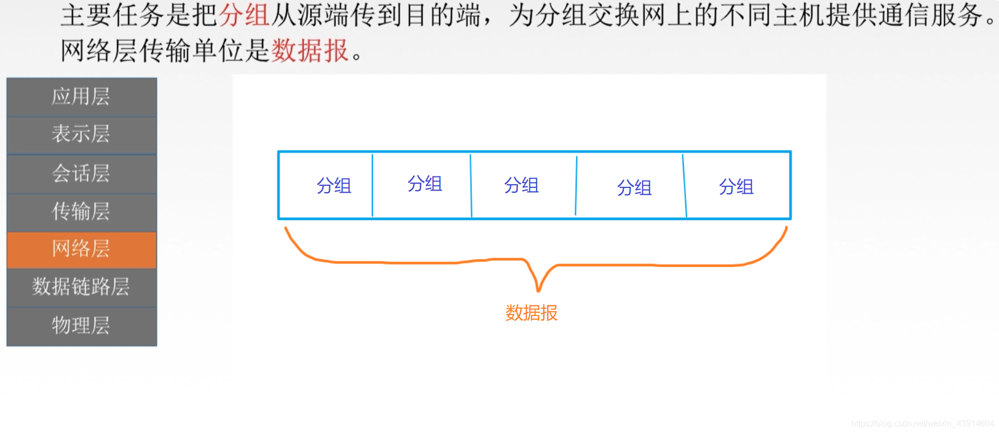
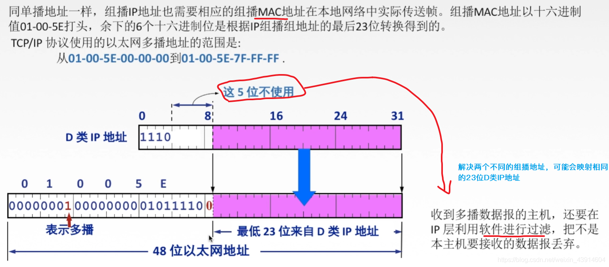
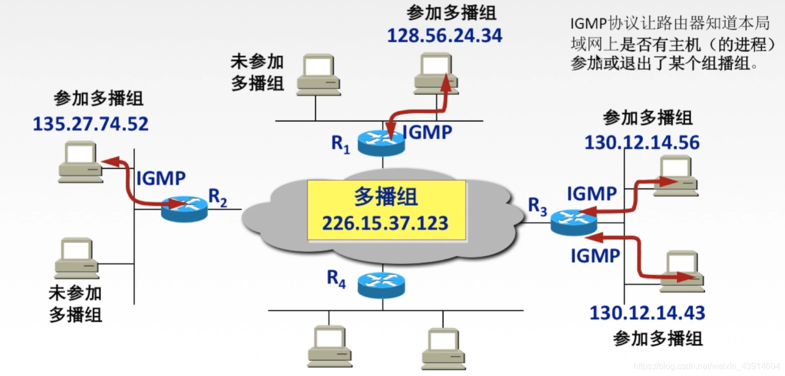
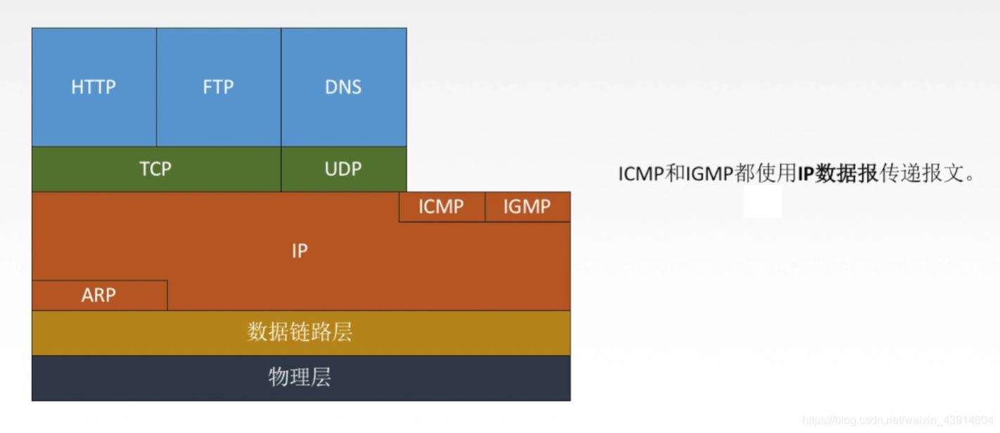
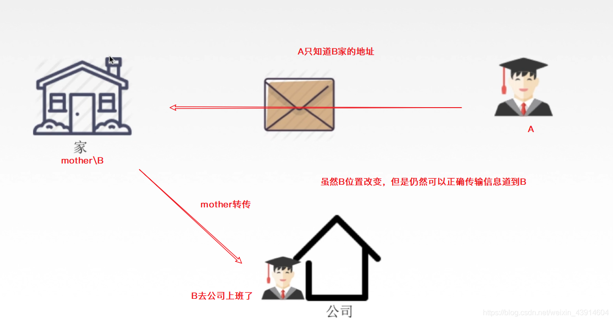
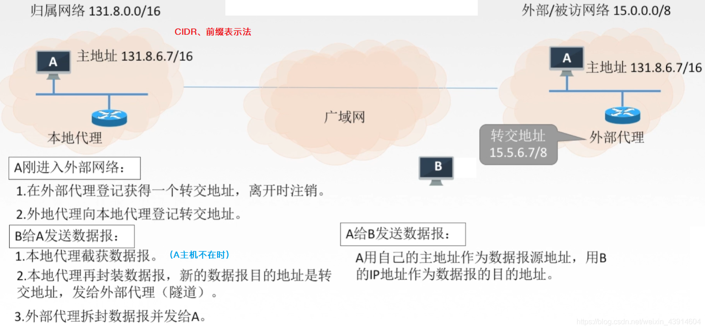
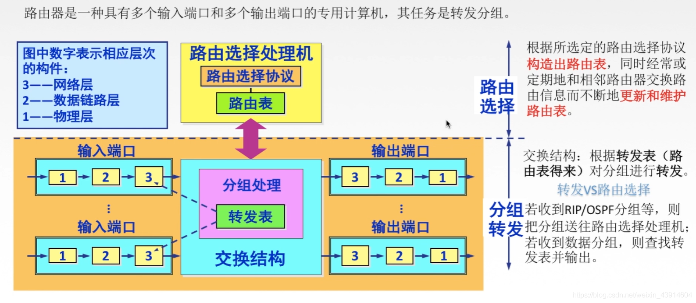
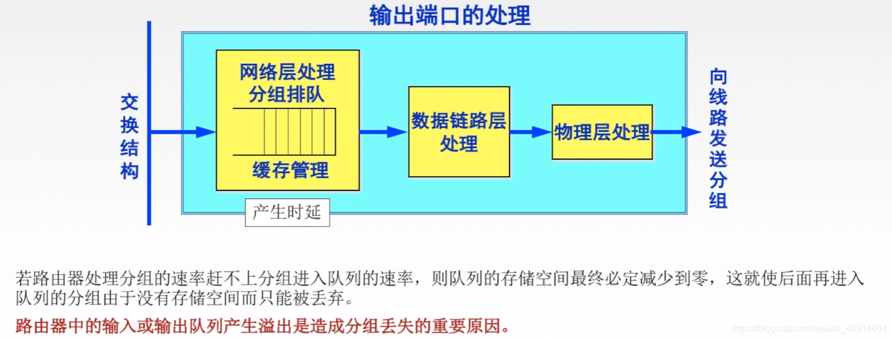
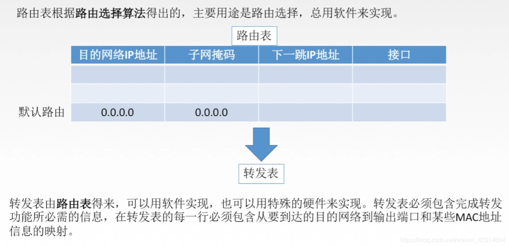

# 网络层

## 4.1 网络层的功能

###  4.1.1 网络层的功能

#### 1.主要任务与传输单位

#### 2.路由选择与分组转发

路由器主要完成两个功能:是路由选择 (确定哪一 条路径)，二是分组转发 (当一个分组 到达时所采取的动作)。

- 1)路由选择。指按照复杂的分布式算法，根据从各相邻路由器所得到的关于整个网络拓扑
  的变化情况，动态地改变所选择的路由。
- 2)分组转发。指路由器根据转发表将用户的IP数据报从合适的端口转发出去

路由表是根据路由选择算法得出的，而转发表是从路由表得出的。
路由表则需要对网络拓扑变化的计算最优化,转发表的结构应当使查找过程最优化。
在讨论路由选择的原理时，往往不去区分转发表和路由表，而是笼统地使用路由表一词。

#### 2.异构网络互联

所谓异构网络互联，是指将两个以上的不同的计算机网络，通过一定的方法， 用一种或多种通信处理设备(即中间设备)相互连接起来，以构成更大的网络系统。中间设备又称中间系统或中继系统。
根据所在的层次，·中继系统分为以下4种:

- 1)物理层中继系统:中继器，集线器(Hub)。

- 2)数据链路层中继系统:网桥或交换机。

- 3)网络层中继系统:路由器。

- 4)网络层以上的中继系统:网关。

  

网络互联通常是指用路由器进行网络互联和路由选择。
路由器是一一台专用计算机，用于在互联网中进行`路由选择。

#### 3.拥塞控制

- 在通信子网中，因出现过量的分组而引起网络性能下降的现象称为拥塞。
- 判断网络是否进入拥塞状态的方法是，观察网络的吞吐量与网络负载的关系:如果随着网络负载的增加，网络的吞吐量明显小于正常的吞吐量，那么网络就可能已进入“轻度拥塞”状态;如果网络的负载继续增大，而网络的吞吐量下降到零，那么网络就可能已进入死锁状态。
- 拥塞控制的作用是确保子网能够承载所达到的流量，这是一一个全局性的过程，涉及各方面的行为:主机、路由器及路由器内部的转发处理过程等。单一地增加资源并不能解决拥塞。
- 流量控制和拥塞控制的区别:
- ·流量控制往往是指在发送端和接收端之间的点对点通信量的控制。流量控制所要做的是抑制发送端发送数据的速率，以便使接收端来得及接收。
- 拥塞控制必须确保通信子网能够传送待传送的数据，是一一个全局性的问题，涉及网络中所有的主机、路由器及导致网络传输能力下降的所有因素。
- 拥塞控制的方法有两种:
  1)·**开环控制**。在设计网络时事先将有关发生拥塞的因素考虑周到，力求网络在工作时不产生拥塞。这是一种静态的预防方法。一旦整个系统启动并运行，中途就不再需要修改。开环控制手段包括确定何时可接收新流量、何时可丢弃分组及丢弃哪些分组，确定何种调度决策等。所有这些手段的共性是，在做决定时不考虑当前网络的状态。
  2)**闭环控制**。事先不考虑有关发生拥塞的各种因素，采用监测网络系统去监视，及时检测哪里发生了拥塞，然后将拥塞信息传到合适的地方，以便调整网络系统的运行，并解决出现的问题。闭环控制是基于反馈环路的概念，是一种动态的方法。

###  4.1.2 计算机网络 电路等

#### 0.思维导图

#### 1.几种传输单元名词解析

- 这里探讨的电路交换、报文交换、分组交换，我们可以把这三种交换方式的交换数据单位看成一个整体去理解，不要过分去细究以上几种传输单元名词与这三种交换方式的关系。

#### 2.电路交换

- 在进行数据传输前，两个结点之间必须先建立一条专用 (双方独占)的物理通信路径(由通信双方之间的交换设备和链路逐段连接而成)，该路径可能经过许多中间结点。这一路径在整个数据传输期间一直被独占，直到通信结束后才被释放。
- 因此，电路交换技术分为三个阶段:连接建立、数据传输和连接释放。
- 从通信资源的分配角度来看，“交换”就是按照某种方式动态地分配传输线路的资源。电路交换的关键点是，在数据传输的过程中，用户始终占用端到端的固定传输带宽。
- 电路交换技术的优点如下:
  1)**通信时延小**。由于通信线路为通信双方用户专用，数据直达，因此传输数据的时延非常小。当传输的数据量较大时，这-优点非常 明显。
  2)**有序传输**。双方通信时按发送顺序传送数据，不存在失序问题。
  3)没有冲突。不同的通信双方拥有不同的信道，不会出现争用物理信道的问题。
  4)**适用范围**广。电路交换既适用于传输模拟信号，又适用于传输数字信号。
  5)**实时性强**。通信双方之间的物理通路一旦建立， 双方就可以随时通信。
  6)控制简单。电路交换的交换设备(交换机等)及控制均较简单。

电路交换技术的缺点如下:
1)**建立连接时间长**。电路交换的平均连接建立时间对计算机通信来说太长。
2)**线路独占**，使用效率低。电路交换连接建立后，物理通路被通信双方独占，即使通信线
路空闲，也不能供其他用户使用，因而信道利用率低。
3)**灵活性差**。只要在通信双方建立的通路中的任何一点出了故障，就必须重新拨号建立新
的连接，这对十分紧急和重要的通信是很不利的。
4)**难以规格化**。电路交换时，数据直达，不同类型、不同规格、不同速率的终端很难相互
进行通信，也难以在通信过程中进行差错控制。

注意，电路建立后，除源结点和目的结点外，电路上的任何结点都采取“直通方式”接收数
据和发送数据，即不会存在存储转发所耗费的时间。

#### 3.报文交换

- 数据交换的单位是报文，报文携带有源地址，目标地址，数据等信息。
- 报文交换的主要特点是：存储接受到的报文，判断其目标地址以选择路由，最后，在下一跳路由空闲时，将数据转发给下一跳路由。 中文名报文交换，外文名Message switching。
- 报文交换技术的优点如下:
  1)**无须建立连接**。报文交换不需要为通信双方预先建立一条专用的通信线路，不存在建立
  连接时延，用户可以随时发送报文。
  2)动态分配线路。当发送方把报文交给交换设备时，交换设备先存储整个报文，然后选择
  一条合适的空闲线路，将报文发送出去。
  3)**提高线路可靠性**。如果某条传输路径发生故障，那么可重新选择另一条路径传输数据，
  因此提高了传输的可靠性。
  4)提高线路利用率。通信双方不是固定占有一条通信线路，而是在不同的时间一段一段地
  部分占有这条物理通道，因而大大提高了通信线路的利用率。
  5)**提供多目标服务**。一个报文可以同时发送给多个目的地址，这在电路交换中是很难实现的。
- 报文交换技术的缺点如下:
  1)由于数据进入交换结点后要经历存储、转发这一过程，因此会引起转发时延(包括接收
  报文、检验正确性、排队、发送时间等)。
  2)报文交换对报文的大小没有限制，这就要求网络结点需要有较大的缓存空间。

注意:报文交换主要使用在早期的电报通信网中，现在较少使用，通常被较先进的分组交换
方式所取代。

#### 4.分组交换

- 同报文交换一样，分组交换也采用存储转发方式，但解决了报文交换中大报文传输的问题。分组交换限制了每次传送的数据块大小的上限，把大的数据块划分为合理的小数据块，再加上一些必要的控制信息(如源地址、目的地址和编号信息等)，构成分组(Packet)。 网络结点根据控制信息把分组送到下一结点，下一结点接收到分组后，暂时保存并排队等待传输，然后根据分组控制信息选择它的下一个结点，直到到达目的结点。到达目地之后的数据分组再重新组合起来，形成一条完整的数据。
- 分组交换的优点如下:
  1)**无建立时延**。不需要为通信双方预先建立一条专用的通信线路，不存在连接建立时延，用户可随时发送分组。
  2)**线路利用率高**。通信双方不是固定占有- -条通信线路，而是在不同的时间一-段一段地部分占有这条物理通路，因而大大提高了通信线路的利用率。
  3)**简化了存储管理**(相对于报文交换)。因为分组的长度固定，相应的缓冲区的大小也固定，在交换结点中存储器的管理通常被简化为对缓冲区的管理，相对比较容易。
  4)**加速传输**。分组是逐个传输的，可以使后-一个分组的存储操作与前一一个分组的转发操作并行，这种流水线方式减少了报文的传输时间。此外，传输一个分组所 需的缓冲区比传输一次报文所需的缓冲区小得多，这样因缓冲区不足而等待发送的概率及时间也必然少得多。
  5)**减少了出错概率和重发数据量**。因为分组较短，其出错概率必然减小，所以每次重发的数据量也就大大减少，这样不仅提高了可靠性，也减少了传输时延。
- 分组交换的缺点如下:
  1)**存在传输时延**。尽管分组交换比报文交换的传输时延少，但相对于电路交换仍存在存储转发时延，而且其结点交换机必须具有更强的处理能力。
  2)**需要传输额外的信息量**。每个小数据块都要加上源地址、目的地址和分组编号等信息，从而构成分组，因此使得传送的信息量增大了5%~10%，一定程度上降低了通信效率，增加了处理的时间，使控制复杂，时延增加。
  3)当分组交换采用数据报服务时，可能会**出现失序**、丢失或重复分组，分组到达目的结点时，要对分组按编号进行排序等工作，因此很麻烦。若采用虚电路服务，虽无失序问题，但有呼叫建立、数据传输和虚电路释放三个过程。
- 分组交换根据其通信子网向端点系统提供的服务，还可进一步分为面向连接的虚电路方式和
  无连接的数据报方式。这两种服务方式都由网络层提供。要注意数据报方式和虚电路方式是分组 交换的两种方式。

### （1）数据报

- 作为通信子网用户的端系统发送一个报文时，在端系统中实现的高层协议先把报文拆成若干
  带有序号的数据单元，并在网络层加上地址等控制信息后形成数据报分组(即网络层PDU)。中 间结点存储分组很短一段时间，找到最佳的路由后，尽快转发每个分组。不同的分组可以走不同
  的路径，也可以按·不同的顺序到达目的结点。

### （2）虚电路

- 在虚电路方式中，端系统每次建立虚电路时，选择一个未用过的虚电路号分配给该虛电路，以区别于本系统中的其他虚电路。在传送数据时，每个数据分组不仅要有分组号、校验和等控制信息，还要有它要通过的虚电路号，以区别于其他虚电路上的分组。在虚电路网络中的每个结点上都维持–张虚电路表，表中的每项记录了一个打开的虚电路的信息，包括在接收链路和发送链路上的虚电路号、前一结点和下一结点的标识。数据的传输是双向进行的，上述信息是在虚电路的建立过程中确定的。
- 虚电路之所以是“虚”的，是因为这条电路不是专用的·，每个结点到其他结点之间的链路可能同时有若干虚电路通过，也可能同时与多个结点之间建立虚电路。每条虚电路支持特定的两个端系统之间的数据传输，两个端系统之间也可以有多条虚电路为不同的进程服务，这些虚电路的实际路由可能相同也可能不同。

### （3）数据报服务和虛电路服务的比较

#### 5.报文交换与分组交换的时间消耗比较

#### 6.电路交换、报文交换、分组交换的交换方式比较

 

## 4.2 IPv4

###  4.2.1 IPv4

#### 0 思维导图

#### 1.TCP/IP协议栈

- 首先我们了解一下IP在TCP/IP中的位置

#### 2.IPv4分组

- 网络层将传输层的数据打包后，如果数据很小，可以称为IP数据报，如果数据过大则进行分片，每一片称为IPv4分组。一般数据都比较多，大部分情况都是分组。

##### （1）IPv4分组格式

- 一个IP分组由首部和数据两部分组成。首部前一部分的长度固定，共`20B`，是所有IP分组必须具有的。在首部固定部分的后面是一些可选字段，其长度可变，用来提供错误检测及安全等机制。

**IP首部的部分重要字段含义如下:**

- 1)**版本**。占4位。指IP的版本，目前广泛使用的版本号为4。
- 2)**首部长度**。占4位。以4B为单位，最大值为60B (15*4B)。最常用的首部长度是20B,此时不使用任何选项(即可选字段)。
- 3)**总长度**。占16位。指首部和数据之和的长度，单位为B，因此数据报的最大长度为216-1= 65535B。以太网帧的最大传送单元(MTU)为1500B，因此当一个IP数据报封装成帧时，数据报的总长度(首部加数据) 一定不能超过下面数据链路层的MTU值。
- 4)**标识**。占16位。它是一个计数器，每产生一个数据报就加1,并赋值给标识字段。但它并不是“序号”(因为IP是无连接服务)。当一个数据报的长度超过网络的MTU时，必须分片，此时每个数据报片都复制一次标识号， 以便能正确重装成原来的数据报。
- 5)**标志**。占3位。标志字段的最低位为MF, MF= 1表示后面还有分片，MF= 0表示最后一个分片。” 标志字段中间的一位是DF,只有当DF =0时才允许分片。
- 6)**片偏移**。占13位。它指出较长的分组在分片后，某片在原分组中的相对位置。片偏移以8个字节为偏移单位,8B，即每个分片的长度一定是8B (64 位)的整数倍。
- 7)**首部校验和**。占16位。IP数据报的首部校验和只校验分组的首部，而不校验数据部分。
- 8)**生存时间**(TTL)。占8位。数据报在网络中可通过的路由器数的最大值，标识分组在网络中的寿命，以确保分组不会永远在网络中循环。路由器在转发分组前，先把TTL减1。若TTL被减为0，则该分组必须丢弃。
- 9)**协议**。占8位。指出此分组携带的数据使用何种协议，即分组的数据部分应交给哪个传输层协议，如TCP、UDP等。其中值为6表示TCP,值为17表示UDP。
- 10)**源地址字段**。占4B，标识发送方的IP地址。
- 11)**目的地址字段**。占4B，标识接收方的IP地址。

##### （2）IP数据报分片

- 一个链路层数据报能承载的最大数据量称为最大传送单元(MTU)。因为IP数据报被封装在链路层数据报中，因此链路层的MTU严格地限制着IP数据报的长度，而且在IP数据报的源与目的地路径上的各段链路可能使用不同的链路层协议，有不同的MTU。例如，以太网的MTU为1500B，而许多广域网的MTU不超过576B。当IP数据报的总长度大于链路MTU时，就需要将IP数据报中的数据分装在两个或多个较小的IP数据报中，这些较小的数据报称为片。

- 再回忆一下IP数据报格式的相关字段意义

##### （3）网络层转发分组的流程

**网络层的路由器执行的分组转发算法如下:**

- 1)从数据报的首部提取目的主机的IP地址D，得出目的网络地址N。
- 2)若网络N与此路由器直接相连，则把数据报直接交付给目的主机D，这称为路由器的直接交付;否则是间接交付，执行步骤3)。
- 3)若路由表中有目的地址为D的特定主机路由(对特定的目的主机指明一个特定的路由，通常是为了控制或测试网络，或出于安全考虑才采用的)，则把数据报传送给路由表中所指明的下一跳路由器;否则，执行步骤4)。
- 4)若路由表中有到达网络N的路由，则把数据报传送给路由表指明的下一跳路由器;否则，执行步骤5)。
- 5)若路由表中有一个默认路由，则把数据报传送给路由表中所指明的默认路由器;否则，执行步骤6)。
- 6)报告转发分组出错。

> 注意:得到下一跳路由器的IP 地址后并不是直接将该地址填入待发送的数据报，而是将该IP地址转换成MAC地址(通过ARP，见4.3.4节)，将其放到MAC帧首部中，然后根据这个MAC地址找到下一跳路由器。在不同网络中传送时，MAC帧中的源地址和目的地址要发生变化，但是网桥在转发帧时，不改变帧的源地址，请注意区分。

#### 3.IPv4与NAT

##### （1）IPv4地址

###### ① 组成与分类

连接到因特网上的每台`主机(或路由器)`都分配一个`32比特的全球唯一标识符`，即`IP地址`。传统的IP地址是分类的地址，分为`A、B、C、D、E`五类。

- 无论哪类IP地址，都由网络号和主机号两部分组成。
- 即IP地址::= {<网络号>, <主机号>}。
- 其中网络号标志主机(或路由器)所连接到的网络。–个网络号在整个因特网范围内必须是唯一的。
- 主机号标志该主机(或路由器)。一台主机号在它前面的网络号所指明的网络范围内必须是唯一的。
- 由此可见，一个IP地址在整个因特网范围内是唯–的。

###### ② 特殊地址不做主机IP地址

- 在各类IP地址中，有些IP地址具有`特殊用途`，不用做主机的IP地址:

###### ③ 常用IP地址ABC使用范围

**常用的三种类别IP地址的使用范围见表**

- A类地址可用的网络数为27-2，减2的原因是:第一，网络号字段全为0的IP地址是保留地址，意思是“本网络”;第二，网络号为127的IP地址是环回测试地址。
- B类地址的可用网络数为214-1，减1的原因是128.0这个网络号是不可指派的。
- C类地址的可用网络数为221-1,减1的原因是网络号为192.0.0 的网络是不可指派的。

###### ④ IP地址的重要特点

**IP地址有以下重要特点:**

- 1)每个IP地址都由网络号和主机号两部分组成，因此IP地址是–种分等级的地址结构。分等级的好处是:①IP地址管理机构在分配IP地址时只分配网络号(第一级)， 而主机号(第二级)则由得到该网络的单位自行分配，方便了IP 地址的管理;②路由器仅根据目的主机所连接的网络号来转发分组(而不考虑目标主机号)，从而减小了路由表所占的存储空间。
- 2）IP 地址是标志一台主机(或路由器)和一条链路的接口。当一台主机同时连接到两个网络时，该主机就必须同时具有两个相应的IP地址，每个IP地址的网络号必须与所在网络的网络号相同，且这两个IP地址的网络号是不同的。因此IP网络上的一一个路由器必然至少应具有两个IP地址(路由器每个端口必须至少分配一个IP地址)。
- 3)用转发器或桥接器(网桥等)连接的若干LAN仍然是同一个网络(同一个广播域)，因此该LAN中所有主机的IP地址的网络号必须相同，但主机号必须不同。
- 4)在IP地址中，所有分配到网络号的网络(无论是LAN还是WAN)都是平等的。
- 5)在同一个局域网上的主机或路由器的IP地址中的网络号必须是一样的。路由器总是具有两个或两个以上的IP地址，路由器的每个端口都有一个不同网络号的IP地址。

##### （2）网络地址转换—NAT

###### ① NAT简介

- 网络地址转换(NAT)是指通过将专用网络地址(如Intranet)转换为公用地址(如Internet),从而对外隐藏内部管理的IP地址。它使得整个专用网只需要一个全球IP地址就可以与因特网连通，由于专用网本地IP地址是可重用的，所以NAT大大节省了IP地址的消耗。同时，它隐藏了内部网络结构，从而降低了内部网络受到攻击的风险。

###### ② 私有IP地址

- 此外，为了网络安全，划出了部分IP地址为私有IP地址。私有IP地址只用于LAN,不用于WAN连接(因此私有IP地址不能直接用于Internet,必须通过网关利用NAT把私有IP地址转换为Internet中合法的全球IP地址后才能用于Internet), 并且允许私有IP地址被LAN重复使用。这有效地解决了IP地址不足的问题。私有IP地址网段如下:

###### ③ 专用互联网/本地互联网

- 在因特网中的所有路由器，`对目的地址是私有地址的数据报一律不进行转发`。这种`采用私有IP地址的互联网络`称为`专用互联网`或`本地互联网`。`私有IP地址`也称`可重用地址`。

###### ④ 如何实现私有IP地址上网

- 使用NAT时需要在专用网连接到因特网的路由器上安装NAT软件，NAT路由器至少有一个有效的外部全球地址。
- 使用本地地址的主机和外界通信时，·NAT路由器使用NAT转换表将本地地址转换成全球地址，或将全球地址转换成本地地址。
- NAT转换表中存放着{本地IP地址:端口}到{全球IP地址:端口}的映射。
- 通过{ip地址:端口}这样的映射方式，
- 可让多个私有IP地址映射到同一一个全球IP地址。

#### 4.子网划分与子网掩码、CIDR

##### （1）子网划分

- `两级IP地址的缺点`:IP地址空间的利用率有时很低;给每个物理网络分配一个网络号会使路由表变得太大而使网络性能变坏;两级的IP地址不够灵活。

- 从1985年起，在IP地址中又增加了一个`“子网号字段”`，使两级IP地址变成了`三级IP地址`。这种做法称为`子网划分`。子网划分已成为因特网的正式标准协议。

**子网划分的基本思路**

- 子网划分纯属一个单位内部的事情。单位对外仍然表现为没有划分子网的网络。
- 从主机号借用若干比特作为子网号，当然主机号也就相应减少了相同的比特。三级IP地址的结构如下: IP地址={<网络号>,<子网号>, <主机号>}。
- 凡是从其他网络发送给本单位某台主机的IP数据报,仍然是根据IP数据报的目的网络号，先找到连接到本单位网络上的路由器。然后该路由器在收到IP数据报后，按目的网络号.和子网号找到目的子网。最后把IP数据报直接交付给目的主机。

##### （2）子网掩码

- `子网掩码`的引入，为了告诉主机或路由器对一个A类、B类、C类网络进行了子网划分，使用子网掩码来表达对原网络中主机号的借位。为了使外部可以连接子网内的网络。

- 子网掩码是一个与IP地址相对应的、长32bit的二进制串,它由一串1和跟随的一串0组成。
- 其中，`1对应于IP地址中的网络号及子网号，而0对应于主机号`。
- 计算机只需将`IP地址`和其对应的`子网掩码逐位“与”`(逻辑AND运算)，就可`得出相应子网的网络地址`。

- 现在的因特网标准规定:所有的网络都必须使用子网掩码。如果一个网络未划分子网，那么就采用默认子网掩码。
- A、B、C类地址的默认子网掩码分别为255.0.0.0、 255.255.0.0、255.255.255.0.
- 例如，某主机的IP地址192.168.5.56，子网掩码为255.255.255.0,进行逐位“与”运算后，得出该主机所在子网的网络号为192.168.5.0。
- 一道例题：

- 另一道例题

**使用子网时的分组转发**

- 由于子网掩码是一个网络或一个子网的重要属性，所以路由器在相互之间交换路由信息时，`必须把自己所在网络(或子网)的子网掩码告诉对方。路由表中的每个条目，除要给出目的网络地址和下一跳地址外，还要同时给出该目的网络的子网掩码`。

**在使用子网掩码的情况下:**

- 1)一台主机在设置IP地址信息的同时，必须设置·`子网掩码`。
- 2)`同`属于一个`子网`的所有`主机及路由器`的相应`端口`，必须设置`相同`的`子网掩码`。
- 3)`路由器的路由表`中，所包含信息的主要内容必须有`目的网络地址、子网掩码、下一 跳地址`。

**使用子网掩码时路由器的分组转发算法如下:**

- 1)从收到的分组的首部提取目的IP地址，记为D。
- 2)先判断是否为直接交付。对路由器直接相连的网络逐个进行检查:用各网络的子网掩码和D逐位相“与”，看结果是否和相应的网络地址匹配。若匹配，则将分组直接交付，否则间接交付，执行步骤3)。
- 3)若路由表中有目的地址为D的特定主机路由，则将分组传送给路由表中所指明的下一跳路由器;否则，执行4)。
- 4)对路由表中的每一行(目的网络地址、子网掩码、下一跳地址)中的子网掩码和D逐位相“与”，其结果为N。若N与该行的目的网络地址匹配，则将分组传送给该行指明的下一跳路由器;否则，执行步骤5)。
- 5)若路由表中有一个默认路由，则将分组传送给路由表中所指明的默认路由器;否则，执行步骤6)。
- 6)报告转发分组出错。

##### （3）无分类域间路由选择CIDR

###### 为什么要发明CIDR?

- 在域名系统出现之后的第一个十年里，基于分类网络进行地址分配和路由IP数据包的设计就已明显显得可扩充性不足 。为了解决这个问题，互联网工程工作小组在1993年发布了一新系列的标准，以定义新的分配IP地址块和路由IPv4数据包的方法。
- 一个IP地址包含两部分：标识网络的前缀和紧接着的在这个网络内的主机地址。在之前的分类网络中，IP地址的分配把IP地址的32位按每8位为一段分开。这使得前缀必须为8，16或者24位。因此，可分配的最小的地址块有256（24位前缀，8位主机地址，2^8^=256）个地址，而这对大多数企业来说太少了。大一点的地址块包含65536（16位前缀，16位主机，2^16^=65536）个地址，而这对大公司来说都太多了。这导致不能充分使用IP地址和在路由上的不便，因为大量的需要单独路由的小型网络（C类网络）因在地域上分得很开而很难进行聚合路由，于是给路由设备增加了很多负担。

**两张图了解CIDR的特点**

**路由器根据路由表转发的CIDR原则：**

**一道考研例题熟悉一下：**

#### 5.地址解析协议---ARP协议

**首先我们得了解一下IP地址与硬件地址的概念**

- IP地址是网络层使用的地址，它是分层次等级的。
- 硬件地址是数据链路层使用的地址(如MAC地址)，它是平面式的。
- 在网络层及网络层之.上使用IP地址，IP地址放在IP数据报的首部，
- 而MAC地址放在MAC帧的首部。
- 通过数据封装，把IP数据报分组封装为MAC帧后，数据链路层看不见数据报分组中的IP地址。

**ARP协议引入：**

- 无论网络层使用什么协议，在实际网络的链路上传送数据帧时，最终必须使用硬件地址。所以需要一种方法来完成 IP地址到MAC地址的映射，这就是地址解析协议(Address ResolutionProtocol, ARP)。 每台主机都设有-一个ARP高速缓存，用来存放本局域网上各主机和路由器的IP地址到MAC地址的映射表，称ARP表。使用ARP来动态维护此ARP表。

**工作过程：**

- 一个题目例子

#### 6.动态主机配置协议---DHCP协议

- `动态主机配置协议`(Dynamic Host Configuration Protocol, `DHCP`)`常用于给主机动态地分配IP地址`，它提供了即插即用联网的机制，这种机制允许一台计算机加入新的网络和获取IP地址而不用手工参与。
- DHCP是应用层协议，它是基于UDP的。

**DHCP的工作原理如下:**

- 使用客户/服务器方式
- 需要IP地址的主机在启动时就向DHCP服务器广播发送发现报文，这时该主机就成为DHCP客户。本地网络上所有主机都能收到此广播报文，但只有DHCP服务器才回答此广播报文。
- DHCP服务器先在其数据库中查找该计算机的配置信息。若找到，则返回找到的信息。
- 若找不到，则从服务器的IP地址池中取一个地址分配给该计
  算机。DHCP服务器的回答报文称为提供报文。

#### 7 网际控制报文协议--- ICMP

- 为了提高IP数据报交付成功的机会，在网络层使用了`网际控制报文协议`(Internet Control Message Protocol, `ICMP`)来`让主机或路由器报告差错和异常情况`。

- ICMP 报文作为IP层数据报的数据，加上数据报的首部，组成IP数据报发送出去。ICMP是IP层协议。

- ICMP报文的种类有两种，即`ICMP差错报告报文`和`ICMP询问报文`。

###### （1）ICMP差错报告报文

- 不发送ICMP差错报文的情况

###### （2）ICMP询问报文

**ICMP的应用**

- ICMP的两个常见应用是分组网间探测PING(用来测试两台主机之间的连通性)和Traceroute(UNIX中的名字，在Windows中是tracert，可以用来跟踪分组经过的路由)。
- 其中PING使用了ICMP回送请求和回答报文，
- Traceroute (Tracert) 使用了ICMP时间超过报文。
- 注意: PING工作在应用层，它直接使用网络层的ICMP，而未使用传输层的TCP或UDP。Traceroute/Tracert工作在网络层。

## 4.3 IPv6

###  4.3.1 IPv6

#### 0.思维导图

#### 1.为什么要有IPV6？

**解决IP地址耗尽问题的措施有以下三种:**

- ①采用无类别编址CIDR，使IP地址的分配更加
  合理;
- ②采用网络地址转换(NAT)方法以节省全球IP地址;
- ③采用具有更大地址空间的新版本的IPv6。

其中前两种方法只是延长了[IPv4](https://so.csdn.net/so/search?q=IPv4&spm=1001.2101.3001.7020) 地址分配结束的时间，只有第三种方法从根本上`解决了IP地址的耗尽问题`。

#### 2.IPV6的数据报格式

在此之前先复习一下IPV4的数据报格式，以便做对比

**IPV6的数据报格式：**

#### 3.IPV6与IPV4的比较

- 虽然IPv6与IPv4不兼容，但总体而言它与所有其他的因特网协议兼容，包括TCP、UDP、ICMP、IGMP、OSPF、BGP和DNS，只是在少数地方做了必要的修改(大部分是为了处理长的地址)。

#### 4.IPV6的地址表示形式

#### 5.IPV6基本地址类型

**IPv6数据报的目的地址可以是以下三种基本类型地址之一.:**

- 1)单播。单播就是传统的点对点通信。
- 2)多播。多播是一点对多点的通信，分组被交付到一-组计算机的每台计算机。
- 3)任播。这是IPv6增加的一-种类型。任播的目的站是-组计算机，但数据报在交付时只交付其中的一台计算机，通常是距离最近的一台计算机。

#### 6.IPV6向IPV4过滤的策略

**IPv4向IPv6过渡可以采用`双协议栈`和`隧道技术`两种策略**

## 4.4 路由算法与路由协议概述

### 4.4.1 路由算法与路由协议概述

#### 0.思维导图

#### 1.路由算法分类与路由表

#### 2.静态路由和动态路由

#### 3.动态路由的两种算法：

- 链路状态路由算法和距离向量路由算法的比较
- 在距离-向量路由算法中，每个结点仅与它的直接邻居交谈，它为它的邻居提供从自己到网络中所有其他结点的最低费用估计。
- 在链路状态路由算法中，每个结点通过广播的方式与所有其他结点交谈，但它仅告诉它们与它直接相连的链路的费用。
- 相较之下，距离-向量路由算法有可能遇到路由环路等问题。

#### 4.层次路由

## 4.5 路由协议

###  4.5.1 路由选择协议

#### 2.路由选择协议的引入

- 为了解决自治系统内部和外部之间的通信问题而创建的协议

#### 3.路由信息协议—RIP协议

##### （1）概述

##### （2）RIP协议和谁交换？交换什么？多久交换一次？

##### （3）距离向量算法

- RIP协议的路由表更新是基于距离向量算法实现的
- 它的具体过程：

来点题目练习一下：

##### （4）RIP协议的报文格式

##### （5）RIP协议好消息传得快，坏消息传的慢

- 图解为什么好消息传得快，坏消息传的慢

#### 4.开放最短路径优先协议—OSPF协议

##### （1）OSPF协议概述及其特点

特点：

##### （2）链路状态路由算法

##### （3）OSPF的区域

- 为使OSPF能够用于规模很大的网络，OSPF将一个自治系统再划分为若干更小的范围，称为区域。
- 划分区域的好处是，将利用洪泛法交换链路状态信息的范围局限于每个区域而非整个自治系统，减少了整个网络上的通信量。
- 在一个区域内部的路由器只知道本区域的完整网络拓扑，而不知道其他区域的网络拓扑情况。
- 这些区域也有层次之分。处在上层的域称为主干区域，负责连通其他下层的区域，并且还连接其他自治域。

##### （4）OSPF的分组

类型一至类型五提到的OSPF分组在上面的链路状态路由算法中已经提到

#### 5.什么称为用UDP传送？什么称为用IP数据报传送?

- 用UDP传送是指将该信息作为UDP报文的数据部分
- 直接使用IP数据报传送是指将该信息直接作为IP 数据报的数据部分
- RIP报文是作为UDP数据报的数据部分。
- OSPF协议直接使用IP数据报进行传递

#### 6.边界网关协议—BGP协议

##### （1）和谁交换？交换什么？多久交换？

##### （2）交换信息的过程

##### （3）BGP协议报文格式

##### （4）BGP-4的四种报文

##### （5）BGP协议特点

#### 7.RIP、OSPF、BGP协议比较

## 4.6 IP组播

###      4.6.1 IP组播

##### 0.思维导图

##### 1.IP数据报的三种传输方式

- 以用户看视频为例，进一步了解单播、广播和多播三种传输方式
- 为了能够支持像视频点播和视频会议这样的多媒体应用，网络必须实施某种有效的组播机制。
- 使用多个单播传送来仿真组播总是可能的，但这会引起主机上大量的处理开销和网络上太多的交通量。
- 人们所需要的组播机制是让源计算机一次发送的单个分组可以抵达用一个组地址标识的若干目标主机，并被它们正确接收。

##### 2.IP组播地址

- 上文我们已经知道了`多播`，那么如何才能发给同一组主机相同的数据呢？这就需要了解一下IP组播地址，他就是干这个的。

##### 3.IGMP协议与组播路由选择协议

（1）网际组管理协议---IGMP

（2）IGMP工作的两个阶段

（3）组播路由选择协议

（4）组播路由选择选择协议常用的三种路由算法

## 4.7 移动IP

###      4.7.1 移动IP

##### 		1.什么是移动IP？

- 支持移动性的因特网体系结构与协议共称为移动IP,它是为了满足移动结点(计算机、服务、网段等)在移动中保持其连接性而设计的。
- 更确切地说，移动IP技术是指移动结点以固定的网络IP地址实现跨越不同网段的漫游功能，并保证基于网络IP的网络权限在漫游过程中不发生任何改变。
- 移动IP的目标是把分组自动地投递给移动结点。一个移动结点是把其连接点从一个网络或子网改变到另-一个网络或子网的主机。
- 使用移动IP，一个移动结点可以在不改变其IP地址的情况下改变其驻留位置。

##### 		

##### 		2.移动IP相关术语

##### 		3.移动IP通信过程

## 4.8 路由器

###      4.8.1 网络层设备路由器

##### 		1.路由器

##### 		

##### 		

##### 	2.三个设备之间的区别

##### 		3.路由表与路由转发

